# Implement an Automation to Deploy an OpenAPI spec into OCI API Gateway

## Introduction

The objective of this material is to implement an OpenAPI specification into **OCI API Gateway**. Today you can import a specification but need to deploy the APIs manually.

The base for APIs deployment is this material [Migrate APIs to Oracle Cloud Infrastructure API Gateway with Oracle Integration](https://docs.oracle.com/en/learn/migrate-api-to-api-gateway/#introduction).
This material uses the **Oracle Integration** to deploy the APIs with a **JSON** data.

    [ {
        "API_NAME" : "cep",
        "TYPE" : "REST",
        "METHOD" : "GET",
        "PATH_PREFIX" : "/okecep",
        "PATH" : "/cep",
        "ENDPOINT" : "http://x.x.x.x/cep",
        "QUERY_PARAMETERS" : "cep",
        "GROOVY_SCRIPT" : "",
        "AUTHENTICATION_TYPE" : "BASIC",
        "ENVIRONMENT" : "QA",
        "HEADER" : "",
        "HEADER_VALUE" : ""
    }, {
        "API_NAME" : "calculator",
        "TYPE" : "SOAP",
        "METHOD" : "POST",
        "PATH_PREFIX" : "/dneonline",
        "PATH" : "/calculator",
        "ENDPOINT" : "http://www.example.com/calculator.asmx",
        "QUERY_PARAMETERS" : "",
        "GROOVY_SCRIPT" : "",
        "AUTHENTICATION_TYPE" : "BASIC",
        "ENVIRONMENT" : "DEV",
        "HEADER" : "",
        "HEADER_VALUE" : ""
    } ]

The **OIC** process just deploy the APIs into **OCI API Gateway** and we need more steps.

In this material, all functions will be deployed as an **authorizer function** inside the **OCI API Gateway**. So we can execute the services. You can make a request as a REST service with an authentication. In this examples, we can use the **Oracle IDCS** in the **OCI** with **OAuth2**. You can implement a service using this material [Use OCI API Gateway, Functions and Observability to Validate JSON Content and Monitor API Headers and Body](https://docs.oracle.com/en/learn/validate-json-content-apigw-fn/#introduction)

The material include these services:

- **createApi**: imports an OpenAPI specification into **OCI API Gateway** and results an **OCID** for the API imported. This information will be used in the next services to integrates the API spec with API deployments. This service also validates the API spec, but this validation will be done by the **OCI API Gateway**
- **applyValidationApi**: This service will implement the authorization and the validation following the OpenAPI spec.

>**Note**: All this artifacts are intended **ONLY** to be used as a reference, with no support. You need to review and refine your final code to use in a real environment. 

## CI/CD Considerations

>**The complete process needs to be executed in 2 steps. You can execute:** 
> 
>**createApi + applyValidationApi** 

>**Note:** All the files to implement the services can be downloaded here: [OCI API Gateway Automation](./files/OCI_API_Gateway_Automation_files.zip)

## OCI functions General Considerations

All functions implement **OAuth2** with **IDCS**. 

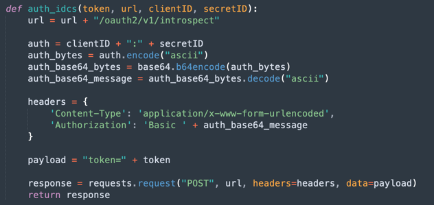

This is the **config** file used to configure the access to the **OCI SDK**. This file works with the **oci_api_key.pem** (the private key file to access the **OCI**).

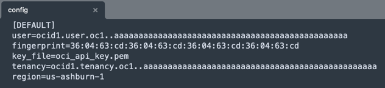

And this is the **config.json** file for **IDCS** configuration.

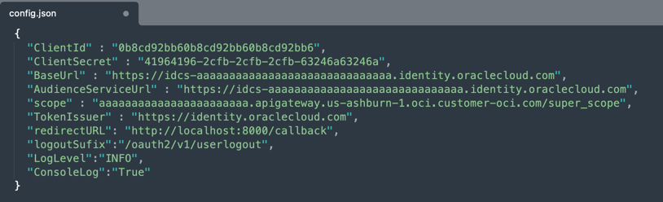

In the **createApi** and **applyValidationApi**, you can work with OpenAPI and Swagger specifications in **JSON** or **YAML** format. This can be done by 2 methods in the code:

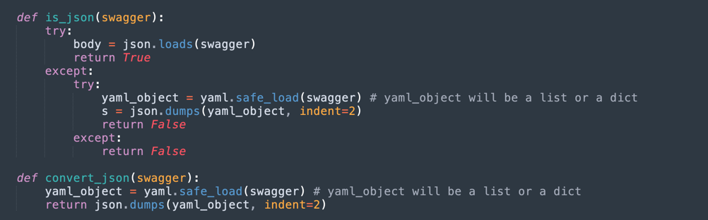

This methods will be used to mantain the specification in **JSON** default format for all codes.

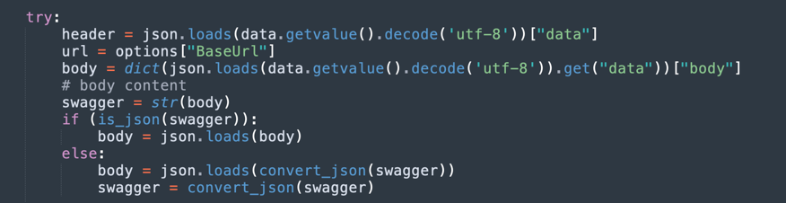

First, we need to import an OpenAPI specification. The **OCI API Gateway** has a REST service to import and validate the spec. We can do it with an **OCI function createApi** .

## createApi

This is the first step to import an OpenAPI spec. **OCI API Gateway** has the ability to import and validate the spec but not to deploy into APIs. 
The **createApi** service will create an API spec, importing your Swagger/OpenAPI spec, validate and prepare to the next step.

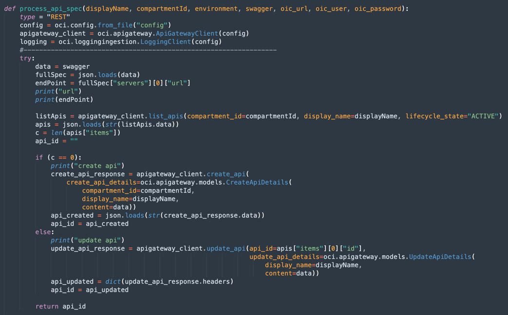

You need to deploy the API (you can see the **deployment** file [createApi.json](./files/createapi/createApi.json) in JSON format to understand the parameters):

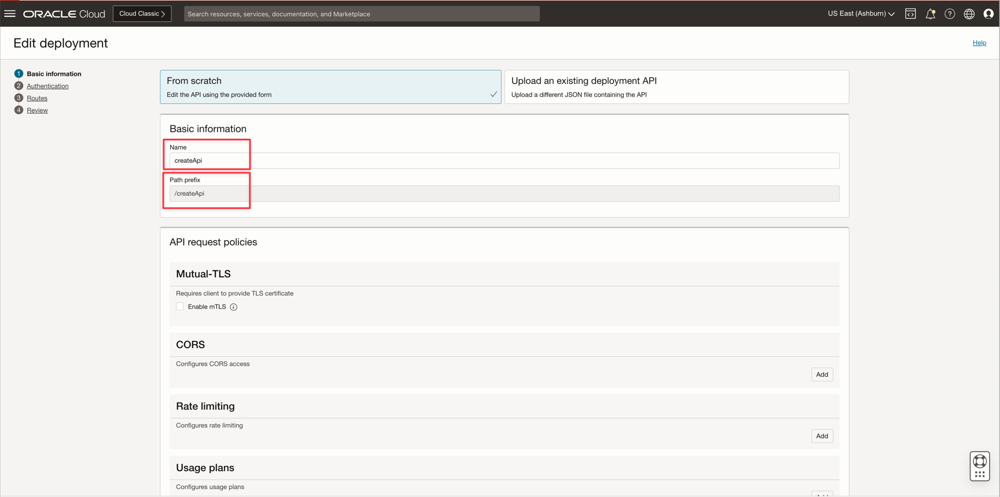

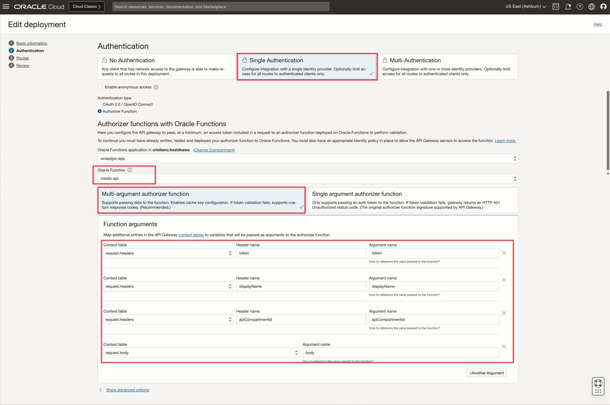

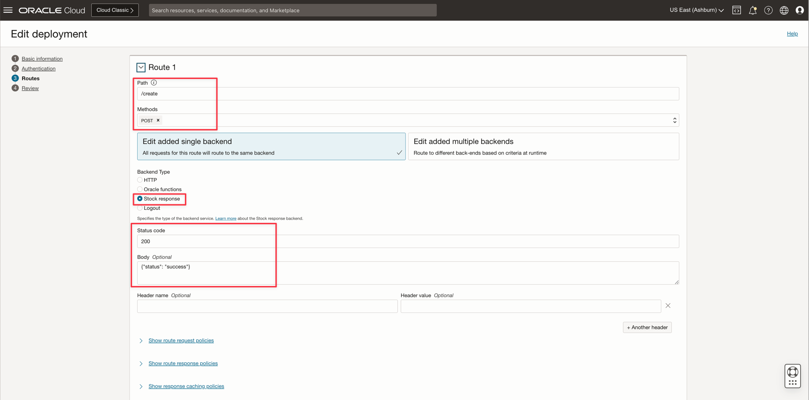

Finally, click on **Show route response policies** and add a **Header Transformation** with:

    Behaviour=Append
    Header name=api_id
    Values=${request.auth[api_id]}

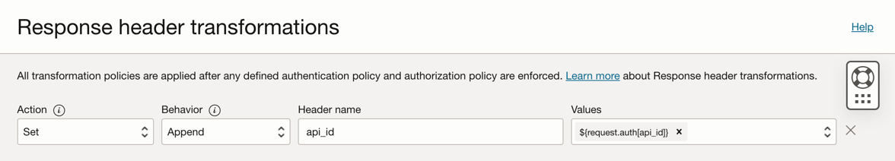

After your **createApi** deployment, you can use it. You will need an authorization token. If you configured the **IDCS OAuth2**, you can follow these instructions to deploy and obtain your OAuth2 token. [Use OCI API Gateway, Functions and Observability to Validate JSON Content and Monitor API Headers and Body](https://docs.oracle.com/en/learn/validate-json-content-apigw-fn/#introduction)

You will need more 3 parameters:

- **displayName**: It's your API spec name in the **OCI API Gateway** and you can choose the same name as your OpenAPI spec or not. Choose any name.
- **apiCompartmentId**: It's your **Compartment OCID** for your **OCI API Gateway** instance. You will need in the next steps
- **< YOUR OPENAPI SPEC >**: It's your **OpenAPI** spec. It could be a file or your text. 

And you can test with:

    curl --location 'https://xxxxxxxxxxxxxxxxxxxxxxx.apigateway.us-ashburn-1.oci.customer-oci.com/createApi/create' \
    --header 'token: <YOUR OAUTH2 TOKEN>' \
    --header 'displayName: EXEMPLO-2024-01-01' \
    --header 'apiCompartmentId: ocid1.compartment.oc1..aaaaaaaaaaaaaaaaaaaaaaaaaaaaaaaaaaaaaaaaaaaaaaaaaaaaaaaaaaaaaaaa' \
    --header 'Content-Type: application/json' \
    --data-raw '<YOUR OPENAPI SPEC>'

>**Note**: This step will be executed fast and you need to obtain the **api_id** to be used in the next steps. The **api_id** will be found in the **HEADER response** (not the BODY response)

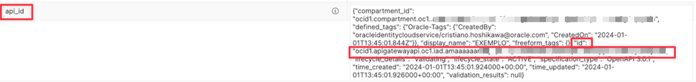

## authApi

This **OCI function** will be used as an authenticator for the APIs deployments. 
It authenticates with the same form used before in the services described here. The function is only an example to use, you can customize your own authorization mechanism.

You need to deploy the function to make it available in the next steps to deploy your automation API process.

>**Note**: After the function deployment, obtain the **OCID** to use with the service **applyValidationApi**.

This is the **IDCS** service authorization by the token passed in BODY and will be used in your function authorization inside your API.

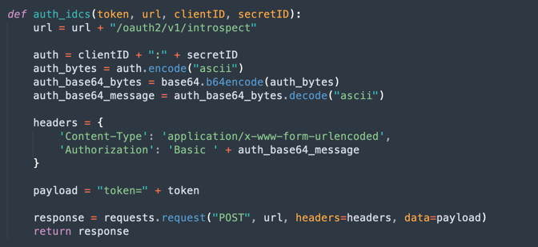

This is the main code for your authorization function and will be described in sequence.

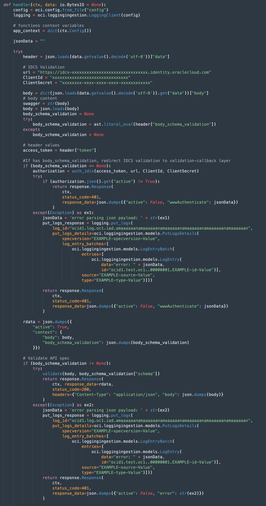

Remember that the API always will be deployed in 2 layers. The first layer will call the second layer. 
Authorization function works only in the second layer for best performance. This will be explained in the next section (**applyValidationApi**)

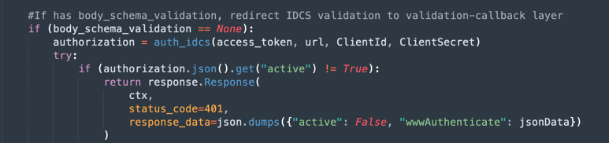

This is the schema validation for Swagger and Open API 3

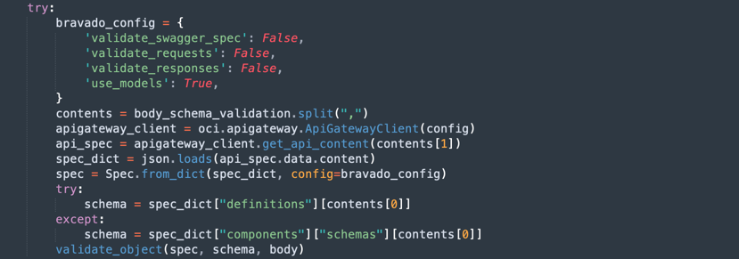

## Redact Validation Response

The project has a schema validation from the spec. When the function is working with authentication, there is a routine for validate the body content, thanks to the open-source bravado library.

The function send the body content and the **Swagger/Open API** specification to bravado libary and this action results in a message. There is a problem here. The results shows the content of the attributes and this need some kind of redaction.

You can redact the attributes content with these codes.

First, you need to import the **bravado** library for **validate_object**.

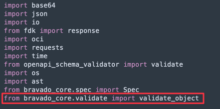

This code is responsible to redact your validation response:

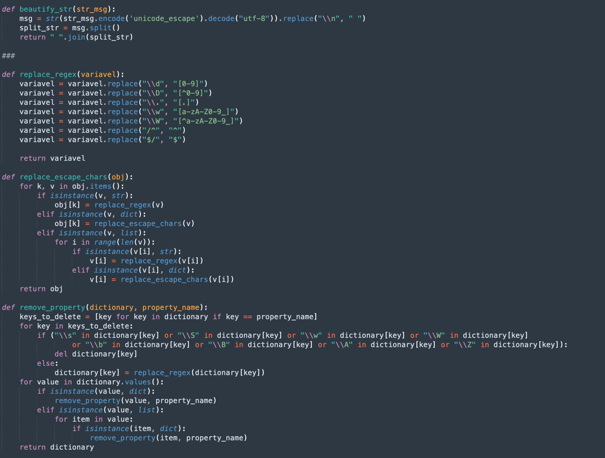

The **remove_property**, **replace_escape_chars** and **replace_regex** methods translate some **escape** codes inside the specification. This works as a pre-validation for redaction. 

And you can put in the main function code:

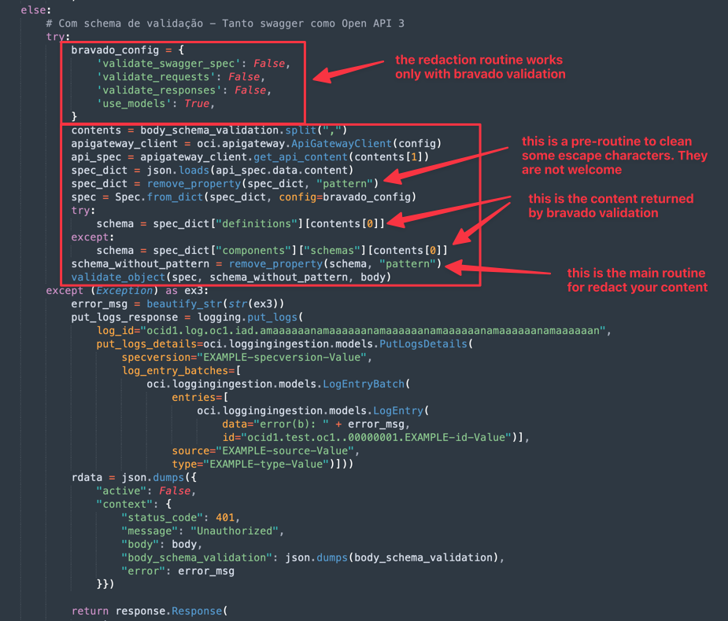

The response will be like this:

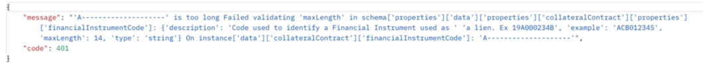

## Resource Principal

[Resource Principal](https://docs.oracle.com/en-us/iaas/Content/Functions/Tasks/functionsaccessingociresources.htm) is another authentication type. This type of authentication replaces the use of **config** and **private key** files and do not expose sensitive data inside your **function**. 

If you need, you can authenticate your **function** through **Resource Principal**, that let **OCI** to recognize the policy for your specific function's **OCID**, without exposing your private key or another sensitive data.
You will need to declare a **Dynamic Group** with your function **OCID** and a policy allowing the use of the **OCI** resources in your code.

**Dynamic Group: acme-func-dyn-grp**

**Policy**

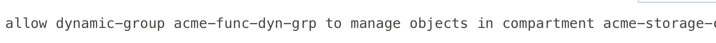

You need to replace your code:

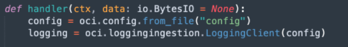

with

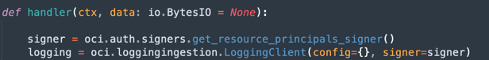

This is the code to change:

    signer = oci.auth.signers.get_resource_principals_signer()
    logging = oci.loggingingestion.LoggingClient(config={}, signer=signer)

See the [authRPApi.py](./files/authApi/authRPApi.py) code with the changes from **OCI Private Key** and **config** files authorization to **OCI Resource Principal** authorization. Remember to rename the **authRPApi.py** to **func.py** and build your function to test.

## Vault Secret

Another way to not expose sensitive data is using **OCI Vault**.
You can configure a [Vault](https://www.ateam-oracle.com/post/using-the-oci-instance-principals-and-vault-with-python-to-retrieve-a-secret) to store your sensitive data like passwords, endpoints, etc.

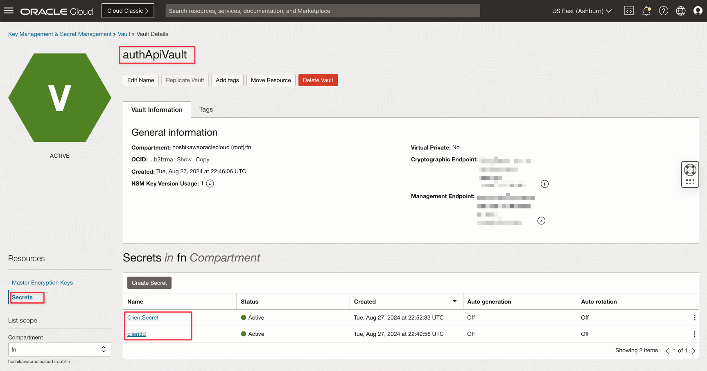

You can create a **Vault** and the secrets for use in your function code:

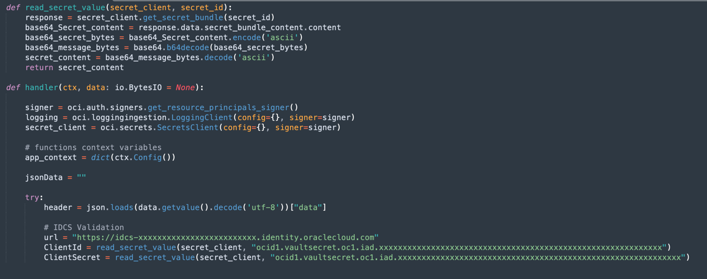

This is the code to obtain the secret value after the **base64** translation.

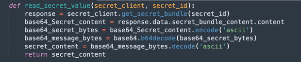

Now, you can specify the **Secret OCID** to obtain the secret. The code are protected by **Resource Principal**.

Declare the method to obtain and decode **base64**:

    def read_secret_value(secret_client, secret_id):
        response = secret_client.get_secret_bundle(secret_id)
        base64_Secret_content = response.data.secret_bundle_content.content
        base64_secret_bytes = base64_Secret_content.encode('ascii')
        base64_message_bytes = base64.b64decode(base64_secret_bytes)
        secret_content = base64_message_bytes.decode('ascii')
        return secret_content

Declare the initialization for your secret client:

    secret_client = oci.secrets.SecretsClient(config={}, signer=signer)

Then you can obtain the secret value specifying your secret **OCID**:

    ClientId = read_secret_value(secret_client, "ocid1.vaultsecret.oc1.iad.xxxxxxxxxxxxxxxxxxxxxxxxxxxxxxxxxxxxxxxxxxxxxxxxxxxxxxxxxxxx")
    ClientSecret = read_secret_value(secret_client, "ocid1.vaultsecret.oc1.iad.xxxxxxxxxxxxxxxxxxxxxxxxxxxxxxxxxxxxxxxxxxxxxxxxxxxxxxxxxxxx")

See the [authRPApi.py](./files/authApi/authRPApi.py) code with the changes to obtain your secrets. Remember to rename the **authRPApi.py** to **func.py** and build your function to test. 

## applyValidationApi

The validation from OpenAPI spec is not possible today. The OCI API Gateway can implement validations with Authorization function. In the process of deploying the API from the OpenAPI spec, we can get the definitions and save it as a HEADER transformation, OCI API Gateway can do it for us, but cannot be used inside the authorization function because the HEADER transformation cannot be loaded in the function runtime execution.

### How to resolve this issue?

To resolve it, we need to deploy the API in 2 layers. 

The first one, we will deploy an API like a proxy to the real API. This proxy API will store the validation spec in a HEADER named **body_schema_validation**. This HEADER will be passed to the real API and can be read by the authorization function.

The validation respecting the OpenAPI spec can be done by this component: [OpenAPI schema validator](https://pypi.org/project/openapi-schema-validator/)

The validation respecting the Swagger 2.0 spec can be done by this component: [Swagger schema validator](https://pypi.org/project/bravado-core/)

The authorization function is deployed in the proxy API deployment and in the real API deployment, but the validation of the spec will be done only in the real API layer and **if** the HEADER **body_schema_validation** has a content.

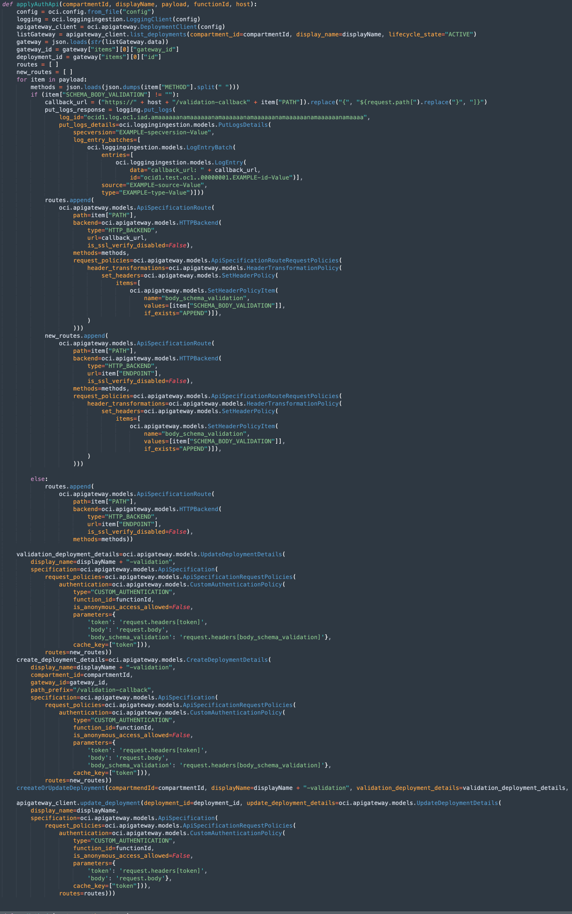

You need to deploy the API (you can see the **deployment** file [applyValidationApi.json](./files/applyValidationApi/applyValidationApi.json) in JSON format to understand the parameters):

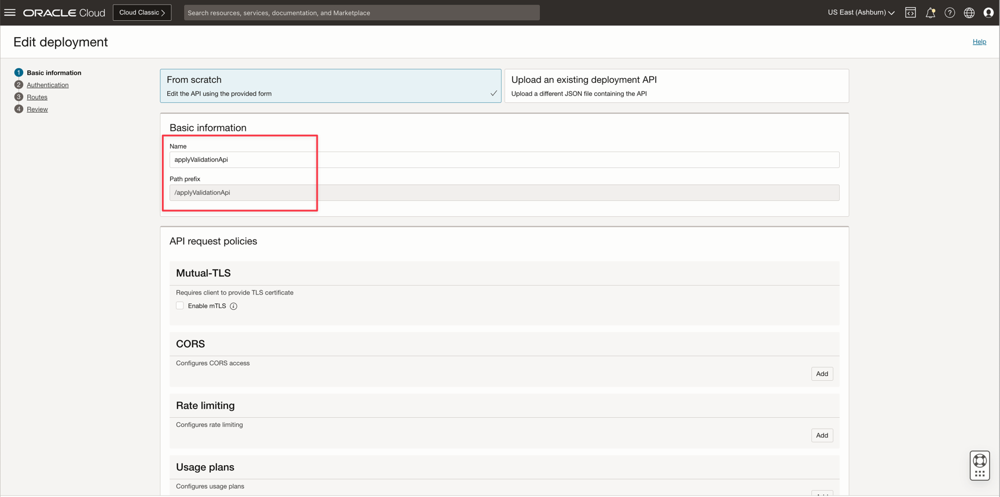

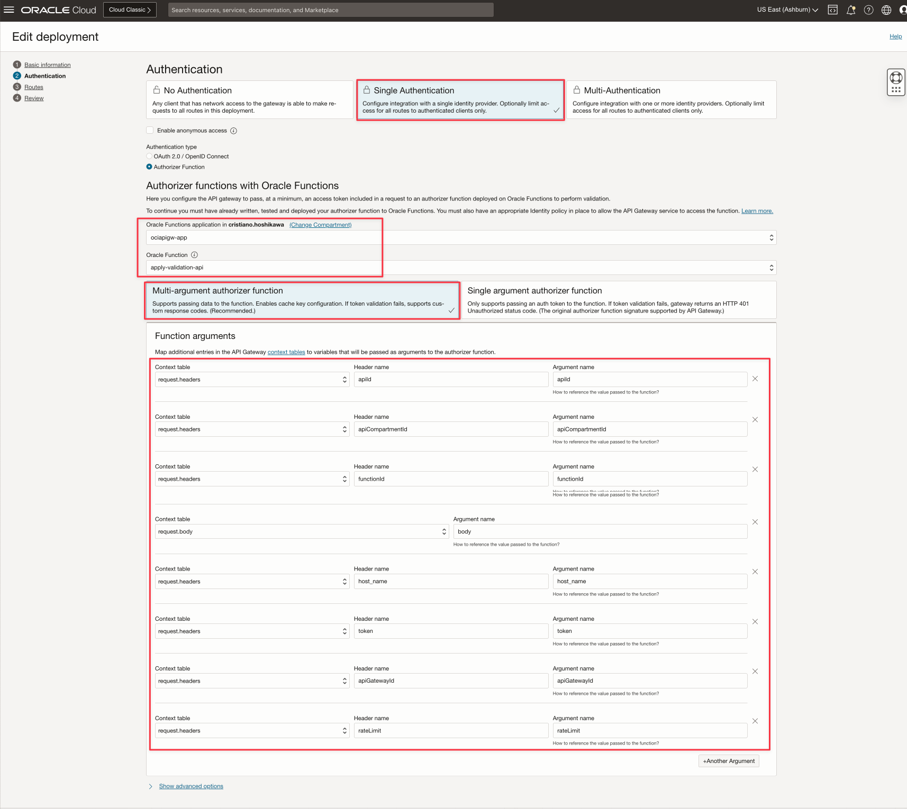

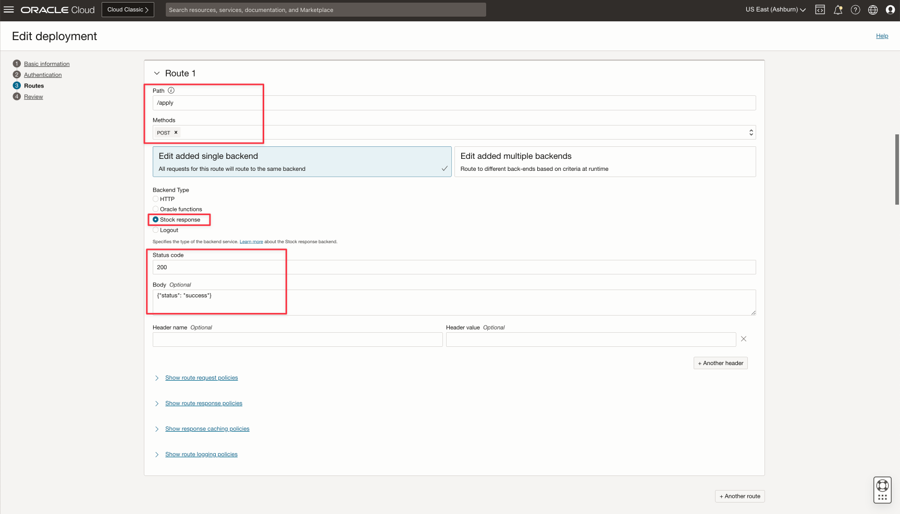

There are 4 news HEADER parameters:

- **apiId**: It's your **OCI API Gateway** API specification **OCID** 
- **functionId**: It's your authorization **OCI function** **OCID** mentioned in **authApi** service.
- **host_name**: It's your **OCI API Gateway** endpoint. You can find this information in the console of your instance.
- **apiGatewayId**: It's your **OCI API Gateway** deployment **OCID** to deploy your specification
- **rateLimit**: It's the rate limit configuration for the **OCI API Gateway** deployment. Put in this format seconds,[CLIENT_IP/TOTAL]. Example: 2000,CLIENT_IP (optional)

And you can test with:

    curl --location 'https://xxxxxxxxxxxxxxxxxxxxxxx.apigateway.us-ashburn-1.oci.customer-oci.com/applyValidationApi/apply' \
    --header 'token: <YOUR OAUTH2 TOKEN>' \
    --header 'apiId: ocid1.apigatewayapi.oc1.iad.amaaaaaanamaaaaaanamaaaaaanamaaaaaanamaaaaaanamaaaaaan' \
    --header 'apiGatewayId: ocid1.apigateway.oc1.iad.amaaaaaanamaaaaaanamaaaaaanamaaaaaanamaaaaaanamaaaaaan' \
    --header 'apiCompartmentId: ocid1.compartment.oc1..aaaaaaaaaaaaaaaaaaaaaaaaaaaaaaaaaaaaaaaaaaaaaaaaaaaaaaaaaaaaaaaa' \
    --header 'functionId: ocid1.fnfunc.oc1.iad.aaaaaaaaaaaaaaaaaaaaaaaaaaaaaaaaaaaaaaaaaaaaaaaaaaaaaaaaaaaa' \
    --header 'host_name: xxxxxxxxxxxxxxxxxxxxxxx.apigateway.us-ashburn-1.oci.customer-oci.com' \
    --header 'rateLimit: 2000,CLIENT_IP' \
    --header 'Content-Type: application/json' \
    --data-raw '<YOUR OPENAPI SPEC>'

## API Deployment - Proxy and Real API layer

There is a main **API Deployment** and this is created when you call the **applyValidationApi** service.

If your OpenAPI spec has validations, your main deployment became into a **Proxy** to other layer. We can call this new layer as **Real API Layer**.

The figure represents the **Real** layer if there is a validation for the API deployment. If no validation in the OpenAPI spec, there is no **Real** layer.
The deployment name will repeat your API Deployment name plus the **-validation** string and the **Path Index** will contains your original **Path** plus **validation-callback** string.

There is an **authorization function** configured automatically. This configuration is in your **applyValidationApi** HEADER request.

There is the **body_schema_validation**, **token** and **body** commented previously.

And finally, there is a **Custom Response for Failed Auth** configuration to return the validation error. This is configured automatically by the **applyValidationApi** service.

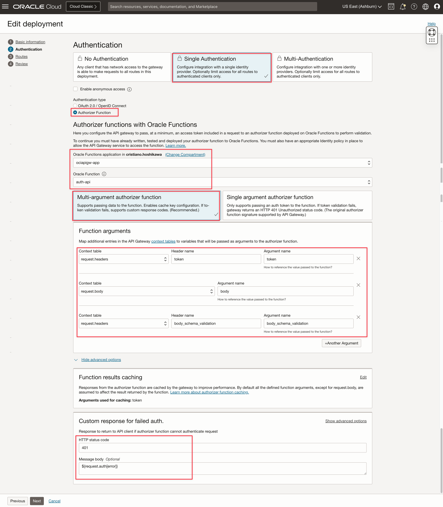

## Conclusion

To create an automation to:

- Import a valid OpenAPI spec
- Deploy automatically the spec in the OCI API Gateway
- Authorize an API with a customized function
- Validate the request from the OpenAPI spec
- Validate the request from the Swagger spec

**OCI API Gateway** needs to implement:

- An API deployment reader from the OpenAPI spec
- Translate the path context variables
- An authorizer customized function
- A way to store the OpenAPI validation spec in each route
- A way to read the OpenAPI validation spec in runtime and validate it from the request content

**OCI API Gateway GAP**

- OCI API Gateway authorization function cannot read Transformations (HEADER, QUERY, BODY)
- OCI API Gateway authorization function cannot obtain the deployment_id, route path and gateway_id while the function is running 
- OCI API Gateway Authorization Function with **IDCS OAuth2** validation has the limitation to 60/90 requests/second but can uses the OCI API Gateway **cache** on HEADER **token**. If you are thinking use the token cache to pass authentication, remember that the Authorization function has the Swagger/OpenAPI validation too, so the validation will not occur. The routine will bypass the validation because of the OCI API Gateway cache.

**These services (createApi, deployApi and applyValidationApi)**

- In the OpenAPI 3 spec, when there is no path_prefix, the service adopts the first path from the spec. Example: path=/v1/test/service ==> path_prefix will be /v1 and path will be /test/service. Not guarantee that **OCI API Gateway** release adopts this approach
- The services does not implement all specifications from Swagger and OpenAPI

## Disclaimer

>**IMPORTANT**: The source code must be used at your own risk. There is no support and/or link with any company. The source code is free to modify and was built solely for the purpose of helping the community

## Acknowledgments

- Author: Cristiano Hoshikawa (Oracle LAD A-Team Solution Engineer)

## Source-Code

- [Source Code for OCI API Gateway Automation](./files/OCI_API_Gateway_Automation_files.zip)

## References

- [Migrate APIs to Oracle Cloud Infrastructure API Gateway with Oracle Integration](https://docs.oracle.com/en/learn/migrate-api-to-api-gateway/#introduction)
- [Use OCI API Gateway, Functions and Observability to Validate JSON Content and Monitor API Headers and Body](https://docs.oracle.com/en/learn/validate-json-content-apigw-fn/#introduction)
- [OpenAPI schema validator](https://pypi.org/project/openapi-schema-validator/)
- [Swagger schema validator](https://pypi.org/project/bravado-core/)
- [Adding Context Variables to Policies and HTTP Back End Definitions](https://docs.oracle.com/en-us/iaas/Content/APIGateway/Tasks/apigatewaycontextvariables.htm)
- [IDCS API Rate Limits](https://docs.oracle.com/en/cloud/paas/identity-cloud/uaids/oracle-identity-cloud-service-pricing-models.html#GUID-C1505A67-9C21-484A-8395-04C4253FA1CD)
- [Create Policies to Control Access to Network and API Gateway-Related Resources](https://docs.oracle.com/en-us/iaas/Content/APIGateway/Tasks/apigatewaycreatingpolicies.htm)
- [SDK Authentication Methods](https://docs.oracle.com/en-us/iaas/Content/API/Concepts/sdk_authentication_methods.htm)
- [Using the OCI Instance Principals and Vault with Python to retrieve a Secret](https://www.ateam-oracle.com/post/using-the-oci-instance-principals-and-vault-with-python-to-retrieve-a-secret)
